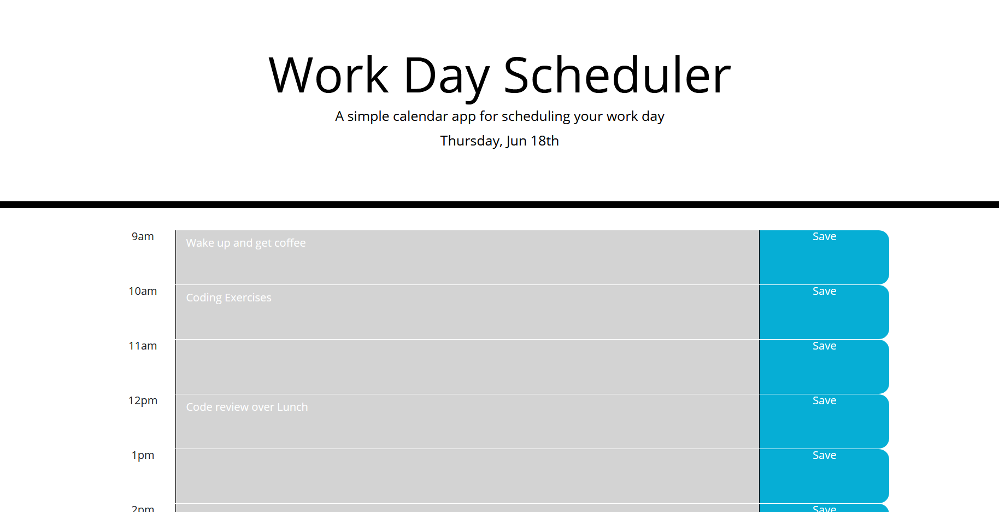

# workDayPlanner

This is my work day planner. This allows the user to keep track of events through out the day. Each block allows you to type in a value. When you click "save" the information is written to internal storage.

url: https://techno-mage.github.io/workDayPlanner/

